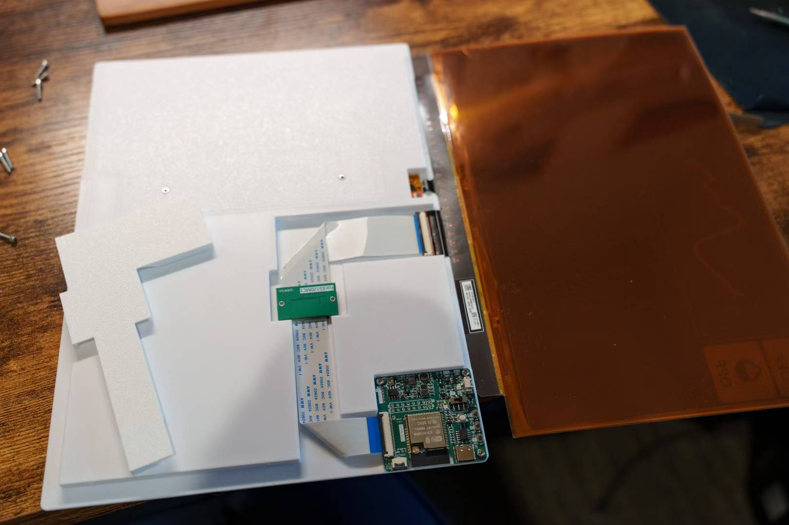

The driver board is from a random [xianyu seller](https://m.tb.cn/h.hkks7A8?tk=KNUK43aBiQb). Which is basically epdiy v7 board, with slight modification.

The display is a 12inch e-ink screen `ES120MC1` from [xinshen liquid crystal] https://m.tb.cn/h.hkNm1Mt?tk=Efla43ZbWn0

The installation process is shown below (all screws are 2-56 UNC screws):

