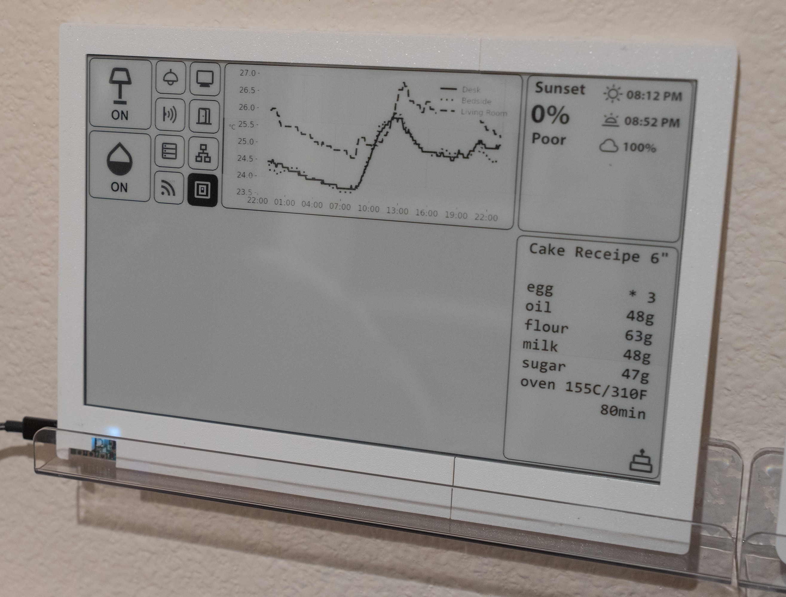

# Inkscreen



# Features
This inkscreen driver and rendering part of this project is based on the  project.

This project uses inkscreen as a convenient tool to display quasi-static information, which support all-day-on display. I have implemented several components, including:

- **Home Assistant Entity Status**: Integrates with Home Assistant to display sensor data/status and refresh in real-time.
- **Timer**: E.g. generate temperature charts every 10 minutes.
- **Notebook**: Randomly keep some notes, such as cake recipes, to-do lists, etc.

For 3D model and hardware design, please refer to the `hardware` folder.

# Design and Structure
To enable better functionality and flexibility, I use python to communicate with ha, plot sensor history, fetch sunset forecast, etc. Each component will have a specific class to render the component to an image file saved in the `output` folder, which will be then displayed on the e-ink screen.

The c program running on the e-ink screen is largely based on the  example of the  repo. Since I uses a 12inch e-ink screen, I have to upload images in small patches due to psram limitation.

The ui is designed to be simple and intuitive. The screen is divided into blocks, each containing a component. You can define the position and size of each block in the `config.yaml` file. I designed the block to be in **dark color** when something **worth paying attention to** happens, such as a sensor is unavailable or the sunset quality is >50% (which is quite rare in my area though!). Then when you take a glance at the screen, you can see the dark blocks and know something is worth checking.

# Usage
Running from the command line:
Create a `secrets.yaml` in root folder using the template `secrets.example.yaml`.
Modify `config.yaml` according to your local ha settings.

```bash
pip install -r requirements.txt
python main.py
```

Running from docker:
```bash
docker build -t inkscreen .
docker compose up -d
```


# Configuration
